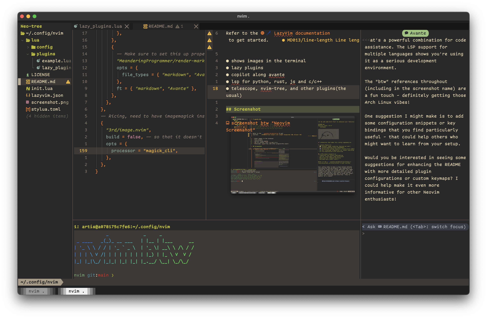

# neovim btw

```code
            _             _     _
 _ ____   _(_)_ __ ___   | |__ | |___      __
| '_ \ \ / / | '_ ` _ \  | '_ \| __\ \ /\ / /
| | | \ V /| | | | | | | | |_) | |_ \ V  V /
|_| |_|\_/ |_|_| |_| |_| |_.__/ \__| \_/\_/

```

Refer to the [💤 LazyVim documentation](https://lazyvim.github.io/installation) to get started.

- shows images in the terminal
- lazy plugins
- copilot along avante
- lsp for python, rust, js and c/c++
- telescope, nvim-tree, and other plugins(the usual)

## Screenshot



### License

This is free and unencumbered software released into the public domain.
